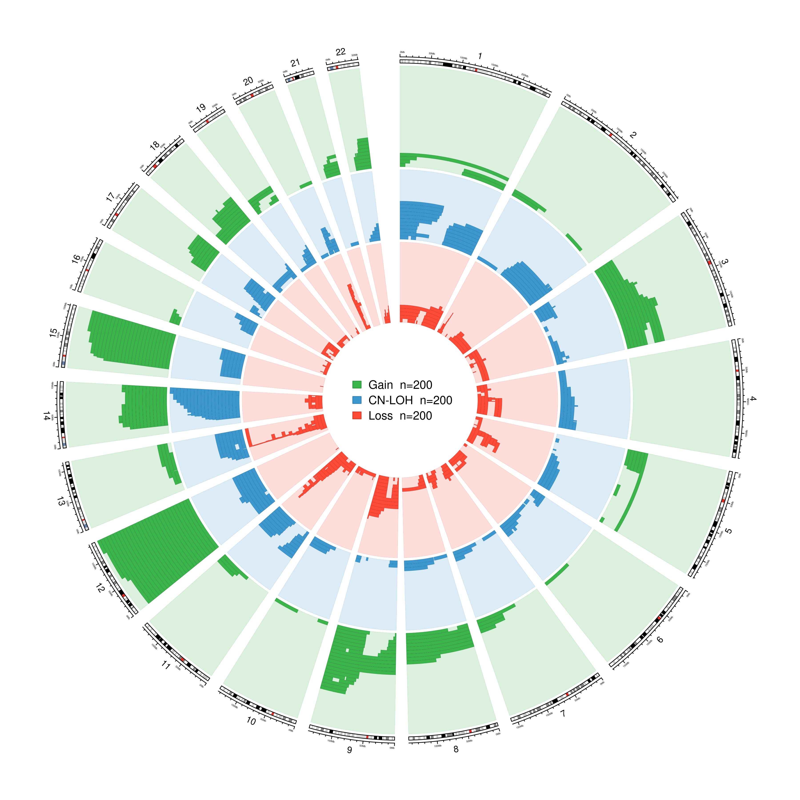

# mosaic-event-circos

R/circlize workflow for plotting autosomal mosaic chromosomal alteration events with automatic lane assignment, automatic track sizing, and equal tile height across event types.

This script was developed for visualizing mosaic event calls such as `Gain`, `CN-LOH`, and `Loss` across autosomes. It is designed to replace manual tuning of Circos tile-track parameters with a reproducible R workflow.



## Features

- Draws autosomal circos plots from tab-delimited mosaic event files.
- Supports `Gain`, `CN-LOH`, and `Loss` by default.
- Assigns overlapping events to separate radial lanes.
- Lets non-overlapping events share a lane.
- Automatically scales track heights from event overlap density.
- Uses equal tile height across event tracks, making event density easier to compare visually.
- Uses light alpha-colored track backgrounds with stronger event tiles.
- Supports both GRCh38/hg38 and GRCh37/hg19 coordinates.
- Writes PNG, PDF, and diagnostic summary tables.
- Uses R only; no command-line Circos installation is required.

## Installation

Install R and the `circlize` package.

```r
install.packages("circlize")
```

Clone or download this repository, then run the script with `Rscript`.

```bash
Rscript plot_mosaic_circos.R --help
```

## Quick Start

For a GRCh38/hg38 input file:

```bash
Rscript plot_mosaic_circos.R \
  --input=example_data/mosaic_events_autosomal.example.txt \
  --output-prefix=example_output/mosaic_events_autosomal.example_circos \
  --genome=hg38
```

This writes:

```text
example_output/mosaic_events_autosomal.example_circos.png
example_output/mosaic_events_autosomal.example_circos.pdf
example_output/mosaic_events_autosomal.example_circos_track_summary.tsv
example_output/mosaic_events_autosomal.example_circos_lane_summary_by_chrom.tsv
```

For a GRCh37/hg19 input file:

```bash
Rscript plot_mosaic_circos.R \
  --input=example_data/mosaic_events_autosomal.GRCh37.example.txt \
  --output-prefix=example_output/mosaic_events_autosomal.GRCh37_circos \
  --genome=hg19
```

## Suggested Repository Layout

```text
mosaic-event-circos/
  README.md
  plot_mosaic_circos.R
  example_data/
    mosaic_events_autosomal.example.txt
  example_output/
    mosaic_events_autosomal.example_circos.png
    mosaic_events_autosomal.example_circos_track_summary.tsv
  docs/
    method.md
  LICENSE
  .gitignore
```

Before making example files public, replace real sample IDs and other sensitive fields with synthetic or de-identified values.

## Input Format

The input file should be tab-delimited with one event per row.

Required fields:

| Column | Description |
| --- | --- |
| `sample_id` | Sample or subject identifier. Used only for stable sorting during lane assignment. |
| `chrom` | Chromosome, such as `chr1` or `1`. Autosomes `chr1`-`chr22` are plotted. |
| start coordinate | Genomic start coordinate. Default depends on `--genome`. |
| end coordinate | Genomic end coordinate. Default depends on `--genome`. |
| event type | Event class, such as `Gain`, `CN-LOH`, or `Loss`. |

Default coordinate columns:

| Genome option | Start column | End column | Ideogram |
| --- | --- | --- | --- |
| `--genome=hg38` | `beg_GRCh38` | `end_GRCh38` | hg38/GRCh38 |
| `--genome=hg19` | `beg_GRCh37` | `end_GRCh37` | hg19/GRCh37 |

By default, the script looks for an event type column named `type_FINAL`. If `type_FINAL` is absent and a column named `type` exists, the script automatically uses `type`.

You can override the event type and coordinate columns:

```bash
Rscript plot_mosaic_circos.R \
  --input=my_events.txt \
  --output-prefix=output/my_events_circos \
  --genome=hg19 \
  --type-column=type \
  --start-column=start_GRCh37 \
  --end-column=end_GRCh37
```

## Event Types

The default event types are:

```text
Gain,CN-LOH,Loss
```

To change or reorder event types:

```bash
Rscript plot_mosaic_circos.R \
  --input=my_events.txt \
  --output-prefix=output/my_events_circos \
  --types=Gain,CN-LOH,Loss
```

Track order follows the order supplied in `--types`. With the default order:

```text
Outer event track:  Gain
Middle event track: CN-LOH
Inner event track:  Loss
```

## Plot Style

The default color mapping is:

| Event type | Tile color | Background style |
| --- | --- | --- |
| `Gain` | Green | Light green alpha fill |
| `CN-LOH` | Blue | Light blue alpha fill |
| `Loss` | Red | Light red alpha fill |

Backgrounds use the same base color family as the event tiles with `alpha.f = 0.18`, plus a faint track border with `alpha.f = 0.35`. This keeps track identities visible while making the event intervals the strongest visual signal.

## How Lane Assignment Works

A lane is a radial row used to draw events without overlap within the same event type and chromosome.

For each event type and chromosome, the script:

1. Sorts events by start coordinate, end coordinate, and sample ID.
2. Places each event into the first lane where it does not overlap the previous event in that lane.
3. Creates a new lane only when all existing lanes overlap the current event.

Two non-overlapping events can share one lane:

```text
chr1: 10-20 Mb  CN-LOH
chr1: 50-70 Mb  CN-LOH
```

These count as:

```text
n_events = 2
n_lanes  = 1
```

Two overlapping events need two lanes:

```text
chr1: 10-60 Mb  CN-LOH
chr1: 40-80 Mb  CN-LOH
```

These count as:

```text
n_events = 2
n_lanes  = 2
```

The `max_lanes` value in the output summary is the maximum number of lanes required by an event type on any chromosome. It is not the total number of events.

## Automatic Track Sizing

The script reserves a fixed total radial height for all event tracks:

```r
total_height = 0.70
```

This is the combined radial space used by the event tracks. The remaining space is used for chromosome ideograms, cytobands, axis labels, gaps, the legend, and the center of the circos plot.

The final track heights are calculated as:

```r
common_lane_height = total_height / sum(max_lanes)
track_height = max_lanes_for_type * common_lane_height
```

Because every event type uses the same `common_lane_height`, individual tile thickness is the same across tracks. Tracks with more stacked lanes become wider.

Example:

```text
type    n_events  max_lanes  track_height_fraction  lane_height_fraction
Gain    503       76         0.2217                 0.00292
CN-LOH  926       96         0.2800                 0.00292
Loss    575       68         0.1983                 0.00292
```

Here:

```text
total lanes = 76 + 96 + 68 = 240
common lane height = 0.70 / 240 = 0.00292
```

The equal `lane_height_fraction` confirms equal tile height across the three tracks.

## Output Files

Each successful run writes four files:

```text
<output-prefix>.png
<output-prefix>.pdf
<output-prefix>_track_summary.tsv
<output-prefix>_lane_summary_by_chrom.tsv
```

### Track Summary

The track summary reports one row per event type:

| Column | Description |
| --- | --- |
| `type` | Event type. |
| `n_events` | Total number of events of that type. |
| `max_lanes` | Maximum number of lanes needed on any chromosome. |
| `track_height_fraction` | Radial height assigned to that event type track. |
| `lane_height_fraction` | Radial height per lane. This should be equal across event types in the current implementation. |

### Lane Summary by Chromosome

The lane summary reports event density by event type and chromosome:

| Column | Description |
| --- | --- |
| `type` | Event type. |
| `chrom` | Chromosome. |
| `n_events` | Number of events of that type on that chromosome. |
| `n_lanes` | Number of non-overlapping lanes needed for those events. |

This file is useful for identifying which chromosomes drive the maximum lane count.

## Command-Line Options

```text
--input=FILE             Input tab-delimited mosaic events file.
--output-prefix=PREFIX   Output prefix for PNG/PDF/summary files.
--types=A,B,C            Comma-separated event type values to plot.
--type-column=NAME       Event type column. Default: type_FINAL; falls back to type.
--genome=hg38|hg19       Genome build. Default: hg38.
--start-column=NAME      Override start coordinate column.
--end-column=NAME        Override end coordinate column.
--width=PIXELS           PNG width. Default: 3600.
--height=PIXELS          PNG height. Default: 3600.
--dpi=DPI                PNG resolution. Default: 300.
--title=TEXT             Optional plot title.
--no-png                 Do not write PNG.
--no-pdf                 Do not write PDF.
--no-legend              Do not draw the center legend.
--version                Print script version and exit.
```

## Versioning

The script keeps a stable filename:

```text
plot_mosaic_circos.R
```

The script version is recorded inside the file as:

```r
script_version <- "1.0.0"
```

You can check it with:

```bash
Rscript plot_mosaic_circos.R --version
```

For GitHub releases, keep the filename unchanged and use Git tags such as `v1.0.0`, `v1.0.1`, and `v1.1.0` to freeze specific versions. Users can retrieve an exact version with:

```bash
git checkout v1.0.0
```

## Examples

### Public PLCO Subset Example, GRCh38

```bash
Rscript plot_mosaic_circos.R \
  --input=example_data/mosaic_events_autosomal.example.txt \
  --output-prefix=example_output/mosaic_events_autosomal.example_circos \
  --genome=hg38
```

Example track summary:

```text
type    n_events  max_lanes  track_height_fraction  lane_height_fraction
Gain    200       29         0.2819                 0.00972
CN-LOH  200       20         0.1944                 0.00972
Loss    200       23         0.2236                 0.00972
```

The bundled example is a subset sampled from a public PLCO-derived dataset, with sample IDs replaced by synthetic IDs (`S1`, `S2`, ...). If an original sample has multiple selected mosaic events, the same synthetic ID is used for each event from that sample.

### Older GRCh37/hg19 Data

```bash
Rscript plot_mosaic_circos.R \
  --input=example_data/mosaic_events_autosomal.GRCh37.example.txt \
  --output-prefix=example_output/mosaic_events_autosomal.GRCh37_circos \
  --genome=hg19
```

## Running on an HPC Cluster

Example:

```bash
module load R/4.4.1

Rscript plot_mosaic_circos.R \
  --input=mosaic_events_autosomal_all_anno.txt \
  --output-prefix=mosaic_events_autosomal.ugi_all.circos \
  --genome=hg38
```

The script includes compatibility handling for different `circlize` versions. In particular, some older versions do not support `draw.chr.prefix`; the script detects this before using that argument.

## Coordinate System Warning

Use the genome build that matches the input coordinates.

```text
GRCh38 coordinates -> --genome=hg38
GRCh37 coordinates -> --genome=hg19
```

Using GRCh37 coordinates on an hg38 ideogram, or GRCh38 coordinates on an hg19 ideogram, may produce a plot that runs but is coordinate-mismatched.

## Data Privacy

Do not commit real cohort-level data unless sharing is approved.

For public examples:

- Replace sample IDs with synthetic IDs.
- Remove or anonymize cohort-specific identifiers.
- Keep only the columns needed to run the example, or use synthetic values for non-required columns.
- Consider using a small subset of events if the full dataset is sensitive or large.

## Suggested `.gitignore`

```text
data/
output/
*.png
*.pdf
*.tsv
!example_data/*.txt
!example_data/*.tsv
!example_output/*.png
!example_output/*_track_summary.tsv
!example_output/*_lane_summary_by_chrom.tsv
```

Adjust this depending on whether you want to include example output images in the repository.

## Citation / Method Text

Autosomal mosaic chromosomal alteration events were visualized using an R workflow based on the `circlize` package. Events were grouped by type (`Gain`, `CN-LOH`, and `Loss`) and plotted as genomic intervals on autosomal chromosome ideograms. Within each chromosome and event type, overlapping events were assigned to separate radial lanes, while non-overlapping events were allowed to share a lane. Track heights were calculated automatically from the maximum number of lanes required for each event type. A fixed total radial space was reserved for event tracks, and equal lane height was used across event types to enable visual comparison of event density while preventing tile overlap. Event tracks were drawn with light alpha-colored backgrounds and stronger colored event tiles.

## License

Add a license before sharing publicly. MIT or BSD-3-Clause are common choices for small scientific utility scripts, but use the license preferred by your institution or project.
